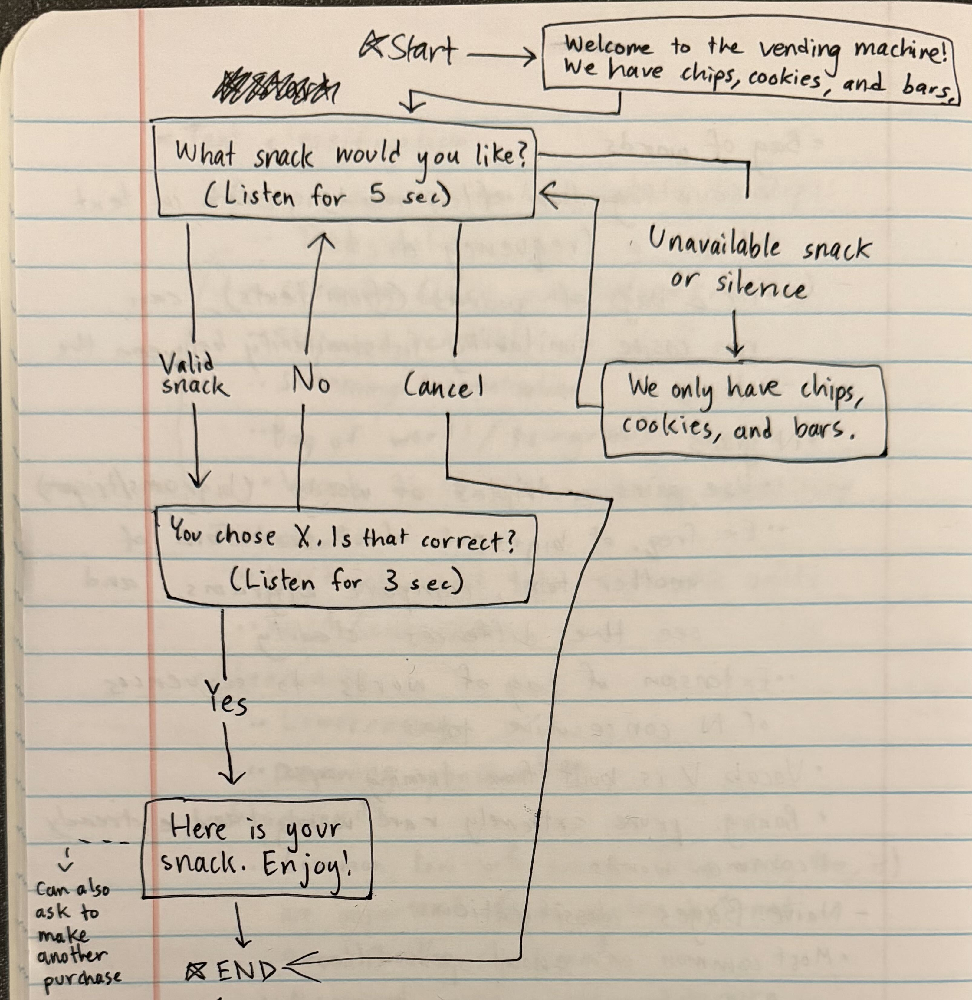
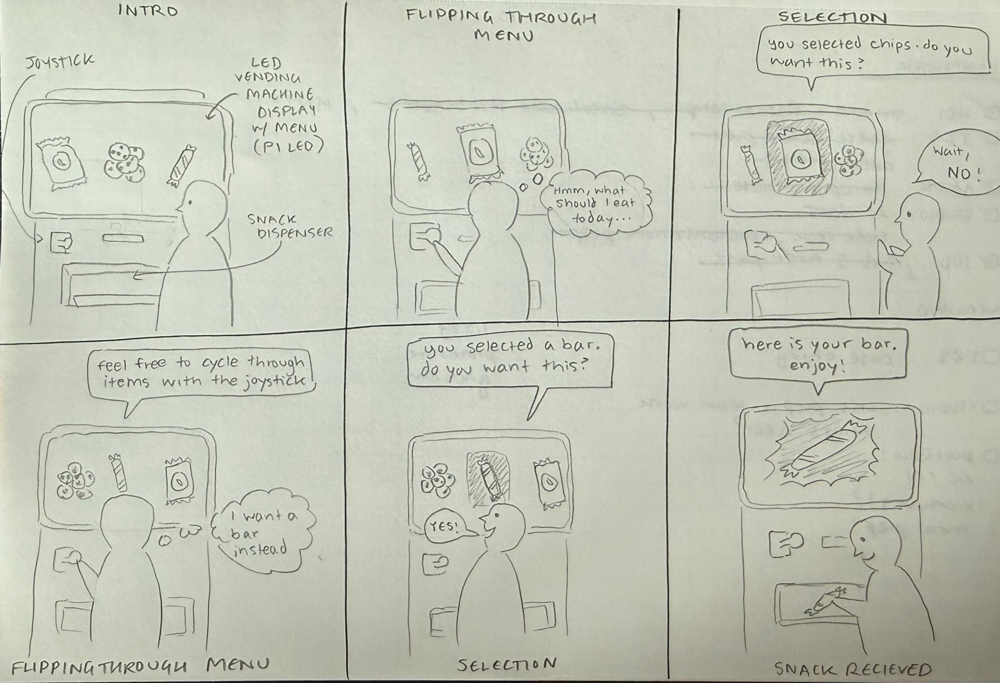

# Chatterboxes

**Nishant Ray (nr487), Gaurav Patel (gp438), Neeha Ravula (nr485), Ammar Syed (as4422)**

<details>
  <summary><strong>Lab intro and setup (Click to Expand)</strong></summary>

[](https://youtu.be/LZ0VJClIlRI?si=Yy84mcyVYuVV19mn)

In this lab, we want you to design interaction with a speech-enabled device — something that listens and talks to you. This device can do anything *but* control lights (since we already did that in Lab 1). First, we want you to storyboard what you imagine the conversational interaction to be like. Then you will use wizarding techniques to elicit examples of what people might say, ask, or respond. We then want you to use the examples collected from at least two other people to inform the redesign of the device.

We will focus on **audio** as the main modality for interaction to start; these general techniques can be extended to **video**, **haptics** or other interactive mechanisms in the second part of the Lab.

A note on what you are building with. Speech interfaces are usually taught as two boxes — speech-in, speech-out — and that framing hides the part that actually determines whether an interaction works. Between listening and speaking sits the question of **whose turn it is**: when does the device decide you have finished talking, and how long does it make you wait before it answers? This lab gives you direct control over both, and we will ask you to notice what changes when you move them.

## Prep for Part 1: Get the Latest Content and Pick up Additional Parts

Please check instructions in [prep.md](prep.md) and complete the setup.

### Pick up Web Camera If You Don't Have One

Students who have not already received a web camera will receive their Webcam and at the beginning of lab. If you cannot make it to class this week, please contact the TAs to ensure you get these.

### Get the Latest Content

As always, pull updates from the class Interactive-Lab-Hub to both your Pi and your own GitHub repo.

**\[recommended\]** Option 1: On the Pi, `cd` to your `Interactive-Lab-Hub`, pull the updates from upstream (class lab-hub) and push the updates back to your own GitHub repo. You will need the *personal access token* for this.

```
pi@ixe00:~$ cd Interactive-Lab-Hub
pi@ixe00:~/Interactive-Lab-Hub $ git pull upstream Fall2026
pi@ixe00:~/Interactive-Lab-Hub $ git add .
pi@ixe00:~/Interactive-Lab-Hub $ git commit -m "get lab3 updates"
pi@ixe00:~/Interactive-Lab-Hub $ git push
```

Option 2: On your own GitHub repo, create a pull request to get updates from the class Interactive-Lab-Hub. After you have the latest updates online, go to your Pi, `cd` to your `Interactive-Lab-Hub` and use `git pull`.

## Setup

Create and activate a virtual environment for this lab:

```
pi@ixe00:~$ cd Interactive-Lab-Hub/Lab\ 3
pi@ixe00:~/Interactive-Lab-Hub/Lab 3 $ python3 -m venv .venv
pi@ixe00:~/Interactive-Lab-Hub/Lab 3 $ source .venv/bin/activate
(.venv) pi@ixe00:~/Interactive-Lab-Hub/Lab 3 $
```

Install the Python dependencies:

```
(.venv) $ pip install -r requirements.txt
```

This takes a few minutes. If you would like it to take considerably less time, [`uv`](https://docs.astral.sh/uv/) is a drop-in replacement for `pip` that is dramatically faster on the Pi:

```
(.venv) $ pip install uv && uv pip install -r requirements.txt
```

Then run the setup script, which installs the classic speech synthesizers, downloads the voice activity detection model, and pre-fetches a neural voice and a speech recognition model so you are not waiting on downloads during lab:

```
(.venv):~$ cd speech-scripts
(.venv) $ ./setup.sh
```

Check your audio devices before going further. `arecord -l` lists capture devices and `aplay -l` lists playback devices; if your webcam microphone or Bluetooth speaker does not appear, fix that first — every script below assumes the system defaults are the ones you want.

</details>

# Part 1

## A. Text to Speech

Your Pi can speak in several quite different ways, and the differences are audible in a way that matters for design. In `speech-scripts/` there are shell scripts for each.

### The classic engines

```
(.venv) $ cd speech-scripts

(.venv) $ sudo apt update
(.venv) $ sudo apt install -y espeak festival festvox-kallpc16k

(.venv) $ ./espeak_demo.sh
(.venv) $ ./festival_demo.sh
```

You can run these `.sh` files by typing `./filename`, and read one with `cat filename`. You can also play audio files directly with `aplay filename` — try `aplay lookdave.wav`.

These are all decades-old technology and they sound like it. `espeak-ng` is a *formant synthesizer*: it generates speech from an acoustic model of the vocal tract, which is why it sounds robotic but also why the whole thing fits in a couple of megabytes and responds instantly. `festival` is *concatenative*: they stitch together recorded fragments of a real speaker, which sounds more human but breaks audibly at the seams.

### Neural TTS with Piper

Note that the Piper command line changed in version 1.x — voices are now downloaded explicitly with `python3 -m piper.download_voices`, and you invoke it as `python3 -m piper`. Tutorials you find online may show the old `echo ... | piper --model ...` form, which no longer works. Browse the [voice samples](https://rhasspy.github.io/piper-samples) and download a different one if you'd like:

```
(.venv) $ python3 -m piper.download_voices en_US-lessac-medium
```

[Piper](https://github.com/OHF-Voice/piper1-gpl) synthesizes speech with a small neural network, runs comfortably on the Pi 5, and sounds markedly better than the above.

```
(.venv) $ ./piper_demo.sh
```

The demo script also shows `--output-raw`, which streams audio to the speaker as it is generated rather than writing a file first. Listen for the difference in how quickly speech begins. In a conversational system this gap is the thing your user experiences as responsiveness.

\*\***Write your own shell file to use your favorite of these TTS engines to have your Pi greet you by name.**\*\*
(This shell file should be saved to your own repo for this lab.)

\*\***Then answer: Is the same greeting, in these different voices, the same greeting? Describe one concrete way the voice changed what the utterance seemed to mean or who seemed to be speaking.**\*\*

Not really. The words are the same, but each voice has a different tone and sounds very different because it's a different speaker/mechanism of generating voice. For example, when they each say "I hope you've been well" it almost means something different due to the different voices. In espeak, it comes out very robotic and flat, almost sounds like it doesn't really mean it or care. The Festival one is a bit better but is very monotone and automated sounding, every word seems to have the same pitch. Piper's actually sounded pretty good and genuine, with natural pauses and increased stress and variable pitch on different words. It made the user/me feel like it actually cared/the message was meaningful. 

## B. Speech to Text

We use [faster-whisper](https://github.com/SYSTRAN/faster-whisper), a reimplementation of OpenAI's Whisper model that runs several times faster on CPU and does not require PyTorch. All processing happens on the Pi; nothing is sent to a server.

```
(.venv) $ python transcribe.py lookdave.wav
```

The transcript is not the interesting output here — the timings are. Run it again with a larger model and compare:

```
(.venv) $ python transcribe.py lookdave.wav --model base.en
(.venv) $ python transcribe.py lookdave.wav --model small.en
#  noted that the first run may take longer because the model is downloaded, and that the HF unauthenticated-request warning is expected and not an error.
```

Available sizes, smallest first: `tiny.en`, `base.en`, `small.en`, `medium.en`. The `.en` variants are English-only and faster than their multilingual counterparts at the same size.

\*\***Record a few seconds of your own speech (`arecord -d 5 -f cd -c 1 -r 16000 test.wav`) and transcribe it with at least two model sizes. Report the real-time factor for each. At what point does the accuracy improvement stop being worth the delay, for a system that has to answer you?**\*\*

On my 5-second recording, tiny.en had a real-time factor of 0.20x (0.99 s, heard "a mar"), base.en was 0.39x (1.94 s, heard "Amara"), and small.en was 1.09x (5.45 s, the only one that got "Ammar" right). Full output from a second run is in [speech-scripts/test_transcripts.md](speech-scripts/test_transcripts.md).

When the system needs to respond to you, the accuracy stops being worth it at around base.en. small.en got it right but it took a big pause of more than 5 seconds to do that before a reply and that's not real time enough for most use cases. It's better to use maybe base.en and fix errors and stuff. 


\*\***Write your own script that verbally asks for a numerical input (a phone number, zipcode, number of pets) and records the answer the respondent provides.**\*\* Numbers are a good stress test — transcription systems make characteristic errors on digit strings, and you will want to know what they are before you design around them.

Script: [speech-scripts/ask_number.py](speech-scripts/ask_number.py)

Model: base.en (1.5 s silence cutoff)
Question: "Say your phone number, zip code, and number of pets."
Transcript: "50, 826, 1879, 1121, number pets is zero."
Transcription time: 2.31 s


## C. Turn-taking: knowing when someone has stopped talking

Everything so far has worked on fixed audio files. A real conversational device does not get told when to start and stop recording — it has to decide. This is the problem that makes speech interfaces hard, and it is mostly not a speech recognition problem.

We use a **voice activity detector** (VAD) to segment the microphone stream into utterances. `listen.py` runs Silero VAD continuously and hands each detected utterance to faster-whisper:

```
(.venv) $ cd speech-scripts
(.venv) $ python listen.py
```

Speak, pause, and watch it transcribe. Now change the endpointing threshold — the amount of silence the system requires before it decides your turn is over:

```
(.venv) $ python listen.py --min-silence 0.2
(.venv) $ python listen.py --min-silence 1.5
```

\*\***Try both extremes, and something in between. Describe what each one feels like to talk to. Note specifically: at 0.2s, what kinds of normal speech get cut off? At 1.5s, what does the delay make the system seem like?**\*\*

There is no correct value. A system that takes drink orders and a system that listens to someone think out loud want very different thresholds, and the right one depends on what your users are doing with their pauses.

At 0.2 seconds, the system cut my voice short. I said "i'd like a coffee um wihth oat milk and acutally to make it a large" but it only captured "with oat milk and actually make it a large." Pauses and filler words were treated as the end of my turn. At 1.5s it captured the entire sentence but I had to wait for a bit in silence afterwards. The 1.5s made be a bit unsure on whether I was done or what the status was. In between at 0.6 seconds it caught my sentence and replied much quicker. 

### The complete loop

`echo_bot.py` puts the pieces together: it listens, endpoints, transcribes, and speaks a reply through Piper. The dialogue policy is deliberately trivial — it repeats what you said — so that everything you notice is a property of the timing rather than the content.


```
(.venv) $ python echo_bot.py
```

## D. Storyboard

Storyboard and/or use a Verplank diagram to design a speech-enabled device. (Stuck? Make a device that talks for dogs. If that is too stupid, find an application that is better than that.)

\*\***Post your storyboard and diagram here.**\*\*

Write out what you imagine the dialogue to be. Use cards, post-its, or whatever method helps you develop alternatives or group responses.

\*\***Please describe and document your process.**\*\*

Your script should include the pauses. Where does your device wait, and for how long? You now know from Part C that this is a parameter you have to choose, not something that happens for free.



We chose a speech-enabled vending machine because it provides a simple, familiar interaction that can be completed through a short conversation. We started with the successful path: the machine asks what snack the user wants, the user chooses, and the machine confirms before announcing that the snack is ready. We then considered alternative responses, including an unavailable snack, an incorrect selection, and silence. These became branches in the diagram, allowing the machine to repeat the available options, accept a correction, or cancel the interaction. We chose a five-second listening window for selecting a snack and a three-second window for confirmation because choosing a snack may take longer than answering yes or no. We also simplified the system by making the snacks free and not having any payment, allowing us to focus on asking for a snack, recognizing the response, and confirming the selection.

## E. Acting out the dialogue

Find a partner, and *without sharing the script with your partner* try out the dialogue you've designed, where you (as the device designer) act as the device you are designing. Please record this interaction (for example, using Zoom's record feature).

\*\***Describe if the dialogue seemed different than what you imagined when it was acted out, and how.**\*\*

Here is our transcript of testing out the device:
- 00:00 Nishant: What snack would you like?
- 00:03 Partner: Uh, what are the options?
- 00:07 Nishant: Please choose chips, cookies, or a bar. (Listens for 5 seconds)
- 00:08 Partner: Oh, okay how about cookies.
- 00:13 Nishant: Please choose chips, cookies, or a bar. (Listens for 5 seconds)
- 00:14 Partner: Cookies.
- 00:19 Nishant: You chose cookies. Is that correct? (Listens for 3 seconds)
- 00:20 Partner: Yes.
- 00:23 Nishant: Here are your cookies. Enjoy!
- 00:24 Nishant: Would you like to make another order? (Listens for 3 seconds)
- 00:25 Partner: Sure.
- 00:24 Nishant: What snack would you like? (Listens for 5 seconds)
- 00:25 Partner: Chips.
- 00:29 Nishant: You chose chips. Is that correct? (Listens for 3 seconds)
- 00:31 Partner: Actually, no.
- 00:34 Nishant: What snack would you like? (Listens for 5 seconds)
- 00:37 Partner: Bar.
- 00:41 Nishant: You chose a bar. Is that correct? (Listens for 3 seconds)
- 00:43 Partner: Yes.
- 00:46 Nishant: Here is your bar. Enjoy! Would you like to make another order? (Listens for 3 seconds)
- 00:48 Partner: No.
- 00:51 Nishant: Have a good day!

[Recording of the interaction](https://drive.google.com/file/d/1If0gT5JYrgCUZfPp079eUhKI9P43WqOS/view?usp=drive_link)

The dialogue felt less natural when acted out than we had imagined. Our partner first asked what the options were, which showed that the machine should list the snacks in its opening question. They also said "Oh, okay how about cookies" instead of simply "Cookies." Repeating the options after that felt awkward because their choice was already clear. The fixed listening windows also created pauses even when my partner answered immediately. However, the confirmation step worked well when they changed their mind about chips, and asking whether they wanted another order made it easy to continue. We would improve the interaction by listing the options upfront, accepting more natural phrases, and responding sooner when the user finishes speaking if possible.

Feedback from other groups:
- [Group #1](https://github.com/Morinzzz/Interactive-Lab-Hub/tree/Fall2026/Lab%203)
  - I really like the idea of vending machine and the states of the machine. I think the states you came up with covered every scenario possible. Maybe the machine can just ask for the snack, no need for welcome message, or maybe indicate how long the welcome message will last.
- [Group #2](https://github.com/9JAyemi/Interactive-Lab-Hub/tree/Fall2026/Lab%203)
  - I like the overall idea for this project and I think the interface is cool. One piece of advice I would say is maybe have the machine not reply too fast in order to process the language of the chosen snack correctly.
- [Group #3](https://github.com/LaboriouslyExquisite/Interactive-Lab-Hub/tree/Fall2026/Lab%203)
  - Here is the feedback: Your idea is very devious! Only letting me have 5 seconds to choose what I want to order is so short! The idea of using voice to order a snack from a vending machine seems super fun though, and perhaps will influence me to buy something without thinking through fully whether or not I actually need a snack. It might fun to have people perhaps maybe dictate how long the system listen for by using a button rather than just a preset 5 seconds. Otherwise, I really like the idea of it checking with me before it actually give me a snack by responding with "You chose X. Is that correct?". Overall very fun project and it would be cool to see it working in real life!

---

# Lab 3 Part 2

For Part 2, you will redesign the interaction with the speech-enabled device using the data collected, as well as feedback from part 1.

## Prep for Part 2

1. What are concrete things that could use improvement in the design of your device? For example: wording, timing, anticipation of misunderstandings.

From the dialogue we found a few issues. Options were hidden, the first thing the partner said was what are the options and the machine doesn't really answer that question. It's also annoying for the transcription to match the exact wording of the item and rely on that to select the snack. Another thing is that listening windows are very fixed and some snacks have a longer name or the user might be thinking a lot. 

2. What are other modes of interaction *beyond speech* that you might also use to clarify how to interact? In particular: how does someone know when the device is listening, and when it is thinking? You have a screen and an LED.

We can use the joystick for browsing through the vending machine items. This addresses the what are the options questions as users can see and figure it out themselves. The screen can show the currently selected item/menu one by one. We can show on the LED the current state on whether the device is listening or speaking or dispensing.

3. Make a new storyboard, diagram and/or script based on these reflections.



4. (optional) Integrate [input devices](inputs.md) in the system

We planned to browse with the Qwiic joystick (as in the storyboard), but we struggled to get it working alongside the screen, so the final version uses the two Adafruit MiniPiTFT buttons instead.

## Prototype your system

The system should:
* use the Raspberry Pi
* use one or more sensors
* require participants to speak to it

*Document how the system works.*

*Include videos or screencaptures of both the system and the controller.*

[Here is the video of our system!](https://youtube.com/shorts/gHbyDP6Z504)


For the system to work, press the top button to browse through snacks and the bottom button to select one. Wait for "LISTENING," then say "yes" to confirm or "no" to return to browsing. Each snack costs $2. Choose "cash" or "card" when prompted. For card payment, say a made-up four-digit number, one digit at a time. Telling the machine 0000 or an invalid number returns you to selection. For cash, state your amount. Telling it an amount that is $2 or more is accepted, while insufficient funds returns you to selection. Successful payment plays a dispensing animation and spoken confirmation. All payments and dispensing are simulated. Repeat the process to order another snack!

Code is in [vending/](vending/): [vending.py](vending/vending.py) runs the machine and the wizard web page, and [screens.py](vending/screens.py) draws the MiniPiTFT screens. Every event is logged to [vending/interaction_log.csv](vending/interaction_log.csv). To run it, install `requirements.txt`, run `speech-scripts/setup.sh`, then:

```
(.venv) $ cd vending
(.venv) $ python vending.py          # Whisper hears the answers
(.venv) $ python vending.py --woz    # the wizard answers from the web page
```

## Test the system

Try to get at least two people to interact with your system. (Ideally, you would inform them that there is a wizard *after* the interaction, but we recognize that can be hard.)

Answer the following:

### What worked well about the system and what didn't?
The system was very clear about what needed to be done and what needed to be said. There was some very nice interactions between exactly what a vending machine would require just inside voice format. The animations also looked really nice for giving the snacks to us. It was sometimes difficult to wait for the vending machine and so we would say something earlier and it wouldn't work and would have to go back and say it again. Also sometimes, there are some versions of yes or no that we would say that wouldn't register as yes or no which is an issue like I would or I wouldn't. We struggled to connect the joystick alongside the screen, so we switched to the Adafruit buttons. This simplified the setup, although cycling through snacks with one button was less flexible than directional navigation.

### What worked well about the controller and what didn't?
The wizard controller (the webpage UI above) provided buttons for common responses and a text field for custom speech, making it possible to guide the interaction manually. Showing the current state helped the operator follow the flow. However, payment answers had to be submitted during the listening stage, so the operator still needed to coordinate their actions carefully with the machine's prompts.

### What lessons can you take away from the WoZ interactions for designing a more autonomous version of the system?
A more autonomous version should preserve the wizard's ability to handle unexpected answers and clarify misunderstandings. Clear listening cues and enough time to respond are especially important when someone is saying several digits. Instead of immediately restarting after an invalid payment response, the system could explain what went wrong and let the user try again.

### How could you use your system to create a dataset of interaction? What other sensing modalities would make sense to capture?
We could collect timestamped prompts, user responses, button presses, wizard interventions, and transaction outcomes to identify common interaction patterns and failures. With participants' consent, audio recordings could reveal recognition errors and awkward pauses, while video could capture gestures, hesitation, and attention to the screen. Comparing wizard decisions with automated responses would help guide improvements.
